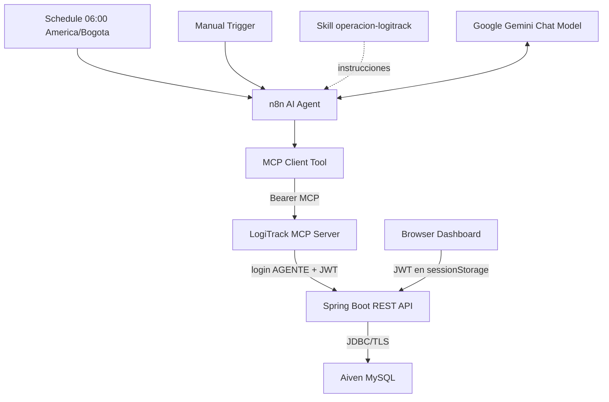

# Arquitectura de LogiTrack IQ

## Autenticación

El navegador obtiene un JWT mediante `POST /auth/login` y lo conserva solo en `sessionStorage`. El MCP mantiene un bearer propio para su borde HTTP; este no es el JWT. Para ejecutar sus seis herramientas, el MCP inicia sesión ante la API con el usuario AGENTE y utiliza el JWT resultante. Ningún secreto, token, host ni contraseña se versiona.

## Responsabilidades

Spring Boot concentra las reglas de dominio, autorización, auditoría, generación de PDF y acceso a datos. El navegador solo presenta la torre de control. El MCP adapta seis operaciones REST permitidas y no accede a MySQL ni recalcula métricas. El Skill y el Agent gobiernan el orden y límites de la automatización; n8n orquesta el flujo y registra la salida controlada.

## Separación de lógica

Las decisiones de inventario, riesgo, transiciones de órdenes y validación de resúmenes se mantienen en Spring Boot. Por tanto, ni frontend, MCP, Skill ni n8n duplican cálculos de stock, cobertura, punto de reorden u ocupación.
