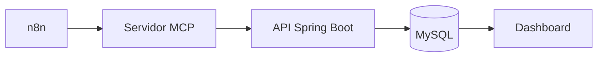
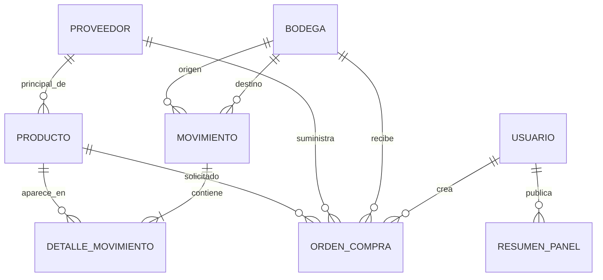

# Diseño de LogiTrack IQ

## 1. Propósito y criterio de diseño

Este documento traduce la especificación a una extensión realizable del backend heredado. Se conserva la arquitectura por capas y solo se agregan responsabilidades necesarias. **REQ** identifica obligaciones del enunciado y **DEC** decisiones técnicas del proyecto.

## 2. Arquitectura actual

El proyecto es una aplicación Spring Boot/Maven organizada en paquetes de configuración, controladores REST, DTOs, entidades JPA, enumeraciones, excepciones, repositorios, seguridad y servicios.

Componentes reutilizables:

- entidades `Producto`, `Bodega`, `Movimiento`, `DetalleMovimiento`, `Inventario`, `Usuario` y `Auditoria`;
- repositorios Spring Data y servicios existentes;
- `MovimientoController`/`MovimientoService` y DTOs de movimiento;
- autenticación JWT, filtro, `UserDetailsService` y reglas de Spring Security;
- roles y usuarios heredados;
- manejador global de excepciones y auditoría.

La aplicación existente conserva `Inventario.stock` y operaciones heredadas. Esto entra en tensión con **REQ**, que establece el libro de movimientos como fuente de verdad para IQ.

## 3. Arquitectura objetivo



La flecha desde MySQL al dashboard expresa el flujo de datos solicitado; técnicamente (**DEC**) el dashboard nunca accede a MySQL: vuelve a consultar la API. MCP tampoco accede a la base. La API concentra autenticación, autorización, validación y reglas.

La solución seguirá una separación sencilla:

1. controllers validan el contrato HTTP y delegan;
2. services aplican reglas, transacciones y auditoría;
3. repositories consultan y persisten;
4. DTOs separan API y entidades;
5. componentes posteriores (`mcp-server/`, `skills/`, `n8n/`, `frontend/`) consumen la API.

## 4. Modelo de entidades



### 4.1 Entidades reutilizadas y modificadas

- `Producto`: conserva sus atributos y agrega `proveedorPrincipal` opcional (`ManyToOne`). `Producto.precio` alimenta `precioUnitarioSugerido` en riesgo (**DEC de extensión**).
- `Bodega`: su capacidad debe ser mayor que cero. Sus movimientos permiten derivar ocupación.
- `Movimiento` y `DetalleMovimiento`: se mantienen como única fuente para cálculos y validaciones IQ. Todo detalle participa.
- `Usuario`: se reutiliza en `creadoPor` y `autor`.
- `Inventario`: permanece temporalmente para compatibilidad, pero ningún servicio IQ ni validación nueva lee `Inventario.stock`.

### 4.2 Entidades nuevas

- `Proveedor`: `id`, `nombre`, `contacto`, `diasEntrega` entre 1 y 90.
- `OrdenCompra`: `id`, `producto`, `proveedor`, `bodegaDestino`, `cantidad`, `precioUnitario`, `total`, `fechaCreacion`, `estado`, `creadoPor`, `pdf` opcional y `fechaGeneracionPdf` opcional. Tiene un solo producto.
- `ResumenPanel`: `id`, `fecha`, `contenidoJson`, `autor`; restricción única por fecha.

Enumeraciones nuevas: `EstadoOrdenCompra` (`BORRADOR`, `APROBADA`, `RECIBIDA`, `CANCELADA`) y `EstadoCobertura` (`SIN_CONSUMO`, `CON_CONSUMO`). Las enumeraciones del JSON del panel se modelarán en DTOs o enums dedicados.

## 5. Decisiones de persistencia

- **DEC-01:** MySQL es la base objetivo. Los scripts PostgreSQL heredados se adaptarán en una tarea posterior, no durante SDD.
- **DEC-02:** dinero usa `BigDecimal`, escala 2 y `HALF_UP`. `total = cantidad × precioUnitario` se calcula en servidor.
- **DEC-03:** métricas conservan precisión interna suficiente y se presentan con escala 2, `HALF_UP`. El riesgo se compara antes de redondear.
- **DEC-04:** `pdf` es un `@Lob` binario asociado a la orden.
- **DEC-05:** una restricción única en `ResumenPanel.fecha` refuerza el único resumen diario; el servicio actualiza la fila existente dentro de una transacción.

## 6. Servicios y reglas

### 6.1 Stock derivado

Un servicio de stock agregará cantidades por producto y bodega:

- `ENTRADA`: `+cantidad` en destino;
- `SALIDA`: `-cantidad` en origen;
- `TRANSFERENCIA`: `-cantidad` en origen y `+cantidad` en destino.

El stock total suma todas las bodegas. El servicio de movimientos consultará ese saldo antes de una salida o transferencia y rechazará toda operación que dejaría alguna bodega negativa. La validación y el guardado ocurren en una transacción.

El endpoint heredado de inventario se adaptará posteriormente para devolver saldos derivados. Durante la transición la tabla `Inventario` puede coexistir, pero no se sincronizará como segunda verdad (**DEC**).

### 6.2 Indicadores y riesgo

Un servicio de indicadores coordinará stock, consumo, órdenes y bodegas. El intervalo de 30 días se modela como `[hoy - 29 días, mañana)` en `America/Bogota`, incluye hoy y solo suma detalles de `SALIDA`. El día anterior se modela como `[ayer, hoy)` y cada movimiento se cuenta una vez por tipo.

Para cada producto con proveedor principal:

```text
consumoDiarioPromedio = salidasUltimos30Dias / 30
puntoReorden = consumoDiarioPromedio × diasEntrega × 1.5
diasCobertura = stockTotal / consumoDiarioPromedio
riesgo = stockTotal < puntoReorden
```

Si el consumo es cero, cobertura es `null` y estado `SIN_CONSUMO`; si es positivo, `CON_CONSUMO`. La bodega sugerida es la de menor stock del producto; en empate, menor id. Se consideran todas las bodegas, por lo que una sin movimientos tiene saldo cero (**DEC aclaratoria**).

### 6.3 Órdenes

`OrdenCompraService` crea siempre `BORRADOR`, valida referencias y cantidad, toma el usuario autenticado y calcula el total. Aplica únicamente:

- `BORRADOR → APROBADA`;
- `BORRADOR → CANCELADA`;
- `APROBADA → RECIBIDA`;
- `APROBADA → CANCELADA`.

Una transición válida elimina `pdf` y `fechaGeneracionPdf`. Para `APROBADA → RECIBIDA`, el mismo método `@Transactional` crea mediante el servicio existente un movimiento `ENTRADA` con un detalle para producto/cantidad y la bodega destino. Una excepción revierte ambos cambios.

### 6.4 PDF y resumen

`PdfOrdenService` usa Apache PDFBox, crea la marca diagonal semitransparente `BORRADOR`, persiste el binario y lo devuelve como `application/pdf`.

`ResumenPanelService` valida DTO, enumeraciones e IDs antes de persistir. Publicar hoy inserta o actualiza la única fila de esa fecha y audita; un error deja intacto el resumen anterior. Consultar devuelve el registro válido de fecha más reciente.

## 7. Estrategia de repositories

Se añadirán repositorios JPA para `Proveedor`, `OrdenCompra` y `ResumenPanel`. Los existentes de producto, bodega y movimientos se ampliarán solo cuando sea necesario.

- Preferir JPQL, métodos derivados y proyecciones portables a SQL dependiente del motor.
- Consultar movimientos por rango temporal y realizar agregaciones bien definidas, incluyendo todos los detalles.
- Permitir filtro opcional de órdenes por estado.
- Buscar resumen por fecha y el más reciente; la restricción única evita duplicados bajo concurrencia.
- Evitar consultas que usen `Producto.stock` o `Inventario.stock` para IQ.

## 8. DTOs y contrato HTTP

Se crearán DTOs específicos para KPIs, stock/desglose, riesgo, bodega crítica, proveedor, creación/respuesta de orden, cambio de estado y resumen. No se expondrá el `@Lob` en respuestas normales de orden.

Los DTOs de entrada usarán Bean Validation y rechazo de propiedades desconocidas para el resumen y el PATCH exacto. `ProductoRiesgoResponse` mantiene todos los campos del PDF y agrega `precioUnitarioSugerido` desde `Producto.precio`.

## 9. Seguridad, auditoría y excepciones

Se conserva la cadena JWT y Spring Security. Se agrega `AGENTE` a los roles. `ADMIN` y `AGENTE` podrán hacer consultas IQ, consultar proveedores/órdenes/PDF, crear borradores y publicar el panel. Solo `ADMIN` podrá cambiar estados y registrar movimientos manuales.

El registro público asignará únicamente el rol público permitido, nunca `ADMIN` ni `AGENTE`. Las cuentas privilegiadas de demostración se crearán con datos reproducibles o una operación administrativa heredada.

La auditoría registrará creación de orden, publicación/reemplazo de resumen, transición y recepción. El manejador global mapeará validación/transición a 400, autenticación a 401, autorización a 403 y ausencia a 404.

## 10. Fechas y zona horaria

Se configurará un bean `Clock` con `ZoneId.of("America/Bogota")` y se inyectará en servicios. Ninguna regla nueva llamará directamente a `now()` sin ese reloj. Las pruebas fijarán instantes y verificarán límites de días calendario.

- `fechaCreacion` y `calculadoEn` proceden del reloj.
- el resumen recibe la fecha local actual;
- los 30 días incluyen hoy y ayer es el día calendario anterior;
- n8n usa la misma zona y ejecuta a las 06:00.

## 11. Datos reproducibles y migración

Una fase posterior adaptará `schema.sql`/`data.sql` de PostgreSQL a MySQL o documentará un mecanismo equivalente. Incluirá proveedores, relaciones principales, capacidades positivas, cuentas de demostración, movimientos `ENTRADA` de inventario inicial y casos de salida/riesgo. No se editan scripts durante SDD.

Los datos no incluirán secretos reales; las credenciales de infraestructura seguirán entrando por variables de entorno.

## 12. Estrategia de pruebas TDD

Las pruebas se escribirán y ejecutarán en rojo antes del código de cada regla:

- unitarias de servicios para stock, fechas, fórmulas, estados, transacción, resumen y PDF;
- pruebas de seguridad para 401/403 y matriz `AGENTE`/`ADMIN`;
- MockMvc para contratos, validación y códigos HTTP;
- al menos una integración Spring Boot/MockMvc para PATCH de estado o POST de resumen;
- configuración de pruebas independiente de MySQL externo, con base embebida y perfil propio (**DEC**).

El `Clock` fijo, constructores de datos y limpieza por prueba harán deterministas los resultados. La evidencia registrará primero la falla esperada y después el resultado verde, sin inventar ejecuciones.

## 13. Coexistencia y cambios previstos

### Se reutiliza

- organización Spring Boot por capas, entidades principales, usuarios, JWT, auditoría y excepciones;
- registro de movimientos y detalles;
- controllers, repositories y services heredados cuando su responsabilidad coincide.

### Se modifica

- `Producto`, `Bodega`, roles/seguridad, movimientos, auditoría y manejo de errores;
- repositorios de movimientos, productos y bodegas para consultas derivadas;
- endpoint heredado de inventario para reflejar saldos calculados;
- scripts y Swagger en fases posteriores.

### Se crea

- capas de proveedor, órdenes, indicadores, stock IQ y resumen;
- configuración del `Clock`, PDFBox y pruebas nuevas;
- tras completar el backend: MCP, skill, n8n y frontend.

Los endpoints heredados permanecen. Si alguno entrega stock persistido, se migrará al saldo derivado sin mantener dos fuentes de verdad.

## 14. Estructura final prevista

```text
src/main/java/com/logitrack/
  config/ controllers/ dto/ entities/ enums/ exceptions/
  repositories/ security/ services/
src/test/java/com/logitrack/
frontend/
mcp-server/
n8n/resumen-diario-inventario.json
skills/operacion-logitrack/SKILL.md
docs/sdd/
```

No se introduce una segunda aplicación backend. Las clases IQ se ubican en los paquetes actuales y usan sus convenciones.

## 15. Ambigüedades resueltas y límites

| Tema no fijado por el PDF | Decisión o límite de diseño |
|---|---|
| Roles de generar/descargar PDF | Se permite a `ADMIN` y `AGENTE`, pues son operaciones de consulta/preparación; cambiar estado sigue siendo exclusivo de `ADMIN`. |
| Orden de “primer producto listado” para n8n | **DEC:** `/productos/riesgo` ordenará por `productoId` ascendente para que la selección sea reproducible. |
| Proveedor de una orden manual frente al principal | El PDF no exige que sean iguales. No se añade esa restricción; la automatización toma el proveedor principal del producto en riesgo. |
| Códigos de éxito no especificados | **DEC:** POST de orden responde 201; publicación/actualización del resumen responde 200. |
| Bodega sin movimientos al sugerir destino | **DEC:** participa con stock cero; en empate gana el id menor. |
| Base para pruebas | **DEC:** perfil aislado y base embebida compatible; MySQL sigue siendo el destino final. |

Estas decisiones no alteran reglas del negocio. Si una prueba de aceptación externa define otra respuesta para un punto no prescrito, se actualizarán primero la especificación y esta tabla, dejando trazabilidad.
